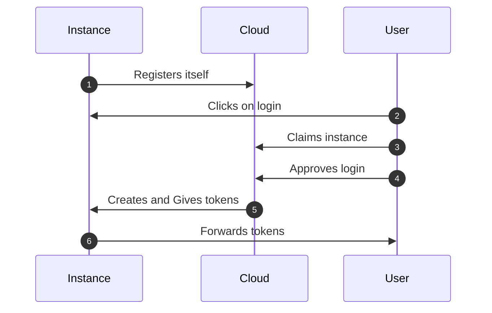
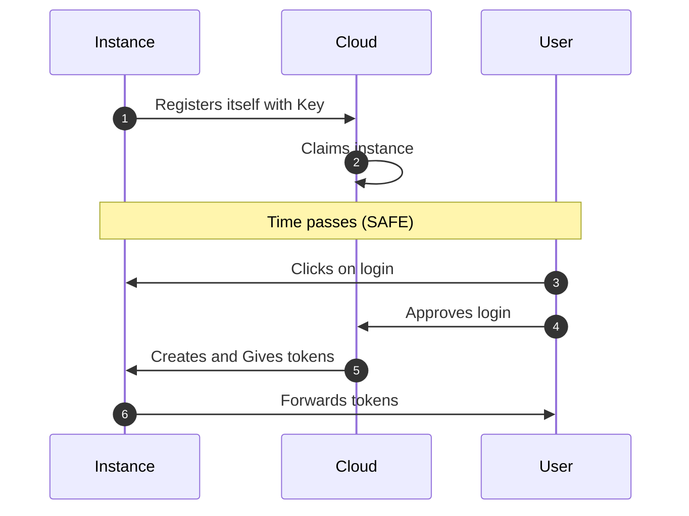

# Registration

When an instance is started for the first time, it will register itself with the [Caido Cloud](./cloud.md) as an [OAuth 2.0 Client](./instance_authentication.md).
At this stage the instance is considered "unclaimed", meaning that **anybody** with access to the instance can claim it for themselves or one of their Teams (in a [Workspace](/dashboard/concepts/workspace)).

You can **only** log into an instance if it has been claimed.

## Human claim

On initial the login, if it the instance is "unclaimed", you can claim it.
This is the same idea if you [reset the credentials](/app/troubleshooting/authentication.html#reset-the-instance-credentials) of your instance.

You are prompted to choose a name and a [Workspace](/dashboard/concepts/workspace) in which the instance will live.
Claiming an instance in a Team workspace will allow team members to access the instance.

The flow usually looks like:

:::warning
Do **NOT** leave instances unclaimed, anybody can claim them and then access the machine on which Caido is installed
:::

## Machine claim

<ProContainer>
This is feature is available starting with Caido v0.56.0 for Teams.
</ProContainer>

For Teams, you can also automatically claim new instances using [Registration Keys](/dashboard/concepts/registration_key). This allows you to deploy a lot of instances in advance for testers (ahead of an engagement) or on demand (in CICD).

This ensures that all the instances are safe even if no human is involved in the deployment.

Currently you need to use the [caido cli](./cli_vs_desktop.md) to pass the Registration Key to the instance.
You can use either the `--registration-key` flag or the environment variable `CAIDO_REGISTRATION_KEY`.

The flow usually looks like:

Check our guide on [how to create a registration key](/dashboard/guides/create_registration_key) to get started.
