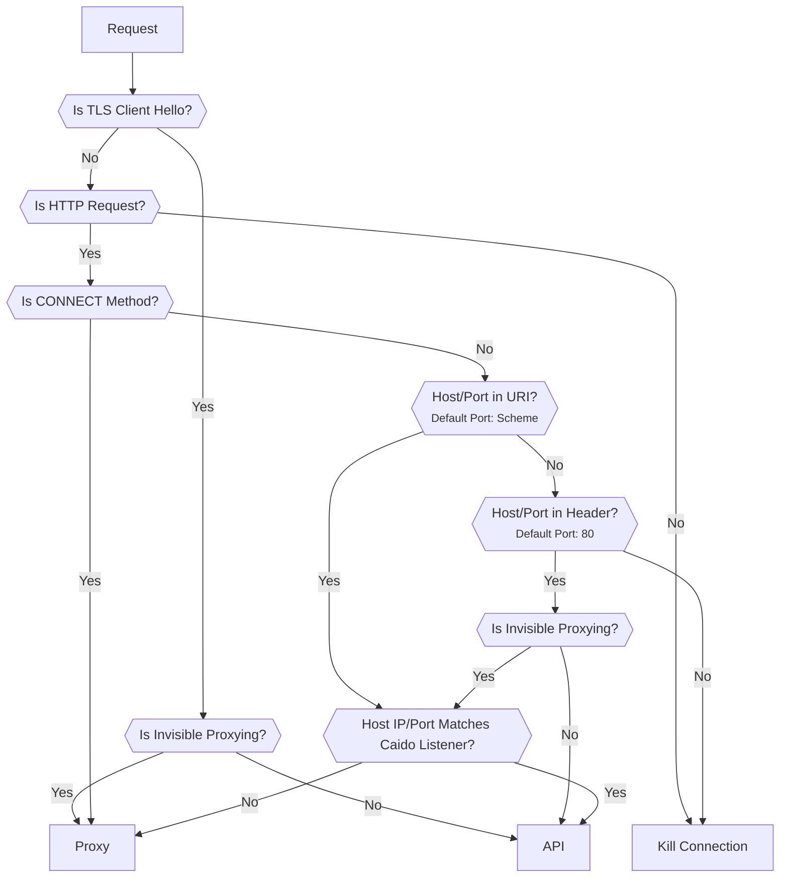
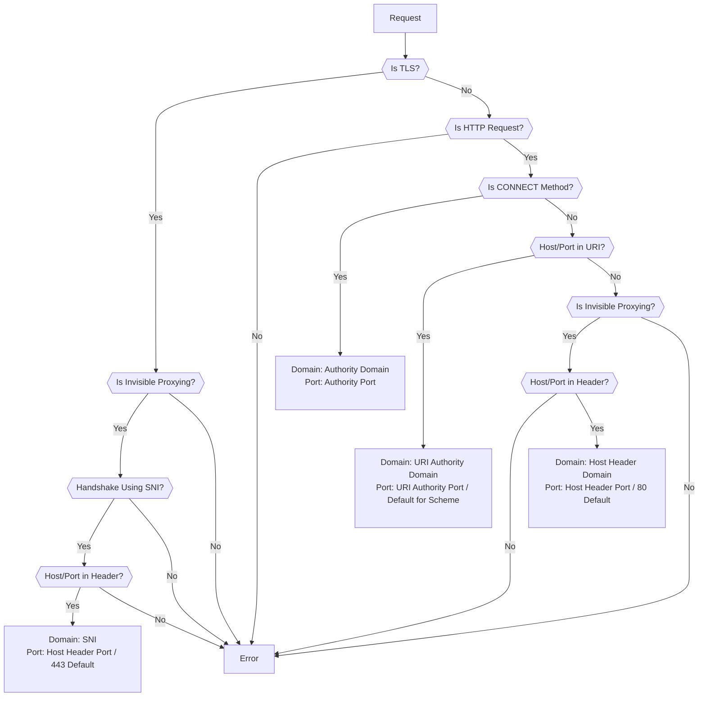

# Traffic Splitting

By default, Caido listens for all traffic on a single port and uses a splitting algorithm to determine if requests are either:

- [GraphQL](/app/concepts/graphql.md) API operations resulting from interactions with the Caido GUI (_client component_).
- Intended to be forwarded to a destination server.

## Traffic Split Algorithm

The following diagram is a representation of the algorithm that is used to route a request to the correct component.

::: warning NOTE
When Caido listens on a specific IP address like `127.0.0.1:8080`, the request's host and port must match the connection URL exactly for the algorithm to route it correctly.

Complications arise when listening on all interfaces (`0.0.0.0:8080`), as the matching behavior depends on which network interface the request arrives on.

In Docker setups with port forwarding (e.g., `docker run -p 8084:8080 caido/caido:latest`), the connection URL inside the container may be `172.17.0.2:8080`, but clients connect to `127.0.0.1:8084`. Since the IP addresses and ports don't match, requests may be incorrectly routed. In these cases, use [specific listeners](/app/guides/listening_ports.md) to separate proxying from the API to ensure proper routing.
:::



### Is TLS Client Hello?

The subsequent request is assumed to be intended for a destination server since the API is not accessible via a TCP/TLS connection using `https://`.

### Is CONNECT Method?

**Yes**: The request is generated by a [proxy-aware](/app/concepts/web_traffic.md#proxy-aware-clients) client. Caido establishes TCP/TLS connections with both the client and the destination server.

**No**: The request's intended recipient requires further evaluation.

### Host/Port in URI?

```http
GET http://www.google.com/ HTTP/1.1


```

If no port is specified, the schema default is used:

- `http://`: 80
- `https://`: 443

### Host/Port in Header?

```http
GET / HTTP/1.1
Host: 127.0.0.1:8080


```

```http
GET / HTTP/1.1
Host: www.google.com
```

If no port is specified, the default is 80.

### Host IP/Port Matches Caido Listener?

The host and port is then compared against the IP and port of Caido's listening address.

| Request | Listening Address | Destination | Response | Error |
|---------|--------------------|-------------|----------|----------|
| GET `http://www.google.com/` HTTP/1.1 | `127.0.0.1:8080` | Proxy | 200 OK | |
| GET `http://www.google.com/` HTTP/1.1 <br> Host: 127.0.0.1 | `127.0.0.1:8080` | Proxy | 301 Moved Permanently <br> Location: `http://www.google.com/` | |
| GET `http://www.google.com/` HTTP/1.1 <br> Host: 127.0.0.1:8080 | `127.0.0.1:8080` | Proxy | 301 Moved Permanently <br> Location: `http://www.google.com:8080/` | Failed to connect: www.google.com:8080 |
| GET `http://127.0.0.1:8080/` HTTP/1.1 | `127.0.0.1:8080` | API | 200 OK | |
| GET `http://127.0.0.1:8080/` HTTP/1.1 <br> Host: www.google.com | `127.0.0.1:8080` | API |  403 Forbidden | Host/IP is not allowed to connect to Caido <br> _View the [Domain Allowlist](/app/guides/domain_allowlist.md) guide._ |
| GET / HTTP/1.1 <br> Host: 127.0.0.1:8080 | `127.0.0.1:8080` | API | 200 OK | |
| GET / HTTP/1.1 <br> Host: 127.0.0.1 | `127.0.0.1:8080` | API | 502 Bad Gateway | Failed to connect: 127.0.0.1:80 |
| GET / HTTP/1.1 <br> Host: www.google.com | `127.0.0.1:8080` | Proxy | 200 OK | |

If [invisible proxying](/app/tutorials/invisible_proxy.md) is enabled and configured to proxy traffic generated by proxy-unaware [thick clients](/app/concepts/web_traffic.md#thick-clients) the behavior will be the same.

However, without a [DNS rewrite](/app/guides/dns_rewrites.md), Caido will not forward the request to the IP address of the destination server. The destination will resolve to the API, resulting in 400 Bad Request responses due to malformed requests.

## Upstream Determination Algorithm

Once Caido has determined that the request should be forwarded to a destination server, it uses the following algorithm to determine to what upstream to send the request to:


