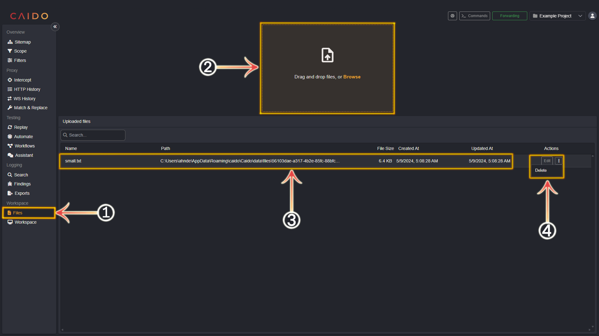
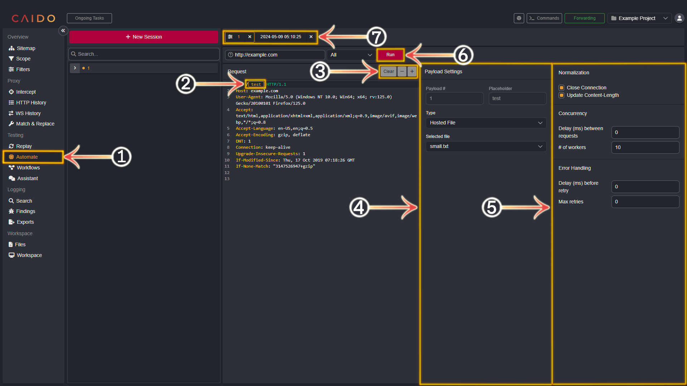

# Modifying Requests and Responses

## Replay

---

`Replay` allows you to repeatedly forward modified requests. **Requests** are shown on the left and **responses** are shown on the right.

- To send a request to `Replay`, either right-click inside the request pane of `Intercept` or `HTTP History` or focus the request pane and use `CTRL+R`.

---

1. Select the `Replay` tab from the left-hand menu within the Caido window.
2. These numerically named tabs are the requests that have been sent to `Replay` in the order they were sent. To select a request, simply click on the desired tab. _You can arbitrarily rename a tab by right-clicking it and selecting `Rename`_.
3. Click the `Send` button to forward the request. Clicking `<` or `>` will sort through the forwarding history of the currently loaded request (_in Caido, the historical recording of forwarded requests is known as a **Session**_).
4. Make any desired modifications to the request in this pane.
5. Once a request has been forwarded - this pane presents the associated response.
6. This is the resulting list of options presented after right-clicking within the request pane.

## Replay Collections and Sessions

---

With Caido, requests are easily organized with the use of **Sessions** and **Collections**.

- **Sessions**: everytime you edit and forward a request within `Replay` - the history of these forwards is recorded into a **Session**.
- **Collections**: you can group Sessions into **Collections** which allows you to organize your requests by shared traits.

1. The request Sessions.
2. The Collections. You can view the list of associated Sessions by clicking `>` to the left of the Collection. To collapse the list, click the `∨`.
3. The request currently in the pane/the total number of recorded requests.
4. Clicking the `New Session` button will present an empty request template. Create a new request manually or enter a URL into the `Enter a connection URL` input box and Caido will automatically generate a valid basic request.
5. Clicking the drop-down arrow of the `New Session` button will present the option to create a new Collection. Click `New Collection` to proceed with this option.

**_To move Sessions between Collections - click, hold and drag the target Session and release on top of the target Collection._**

## Uploading Files for Use in Automate

---

`Automate` allows you to brute-force/fuzz designated elements of a request

- In order to utilize `Automate` - you must first upload payload files/wordlists in the `Files` tab within Caido.

## Files

---

1. Select the `Files` tab from the left-hand menu within the Caido window.
2. Drag and drop the files you wish to upload into this box or click `Browse` to navigate/select the file within your device's file system.
3. Once you have selected a file, it will appear in this pane.
4. You can rename the file by clicking the `Edit` button, entering the desired name and then clicking `Save`. To remove a wordlist click on the `⋮` and select `Delete`.

## Automate

---

- To send a request to `Automate`, either right-click inside the request pane of `Intercept` or `HTTP History` or focus the request pane and use `CTRL+M`.

1. Select the `Automate` tab from the left-hand menu within the Caido window.
2. Highlight the element you wish to brute-force/fuzz.
3. Once the element is highlighted - click `+` to convert it to a placeholder. **_You can remove a placeholder/placeholders by selecting them and then clicking `-` or you can clear all placeholders by clicking `Clear`._**
4. This pane gives multiple payload options: `Hosted File` - select from your uploaded files. `Simple List` - manually create a list. `Null Payload` - Set a number of null payloads to generate.
5. This pane presents additional options for fine-tuning your brute-force/fuzzing campaign such as: setting the value of the **Connection** header to **_keep-alive_** or **_close_**, automatically updating the **Content-Length** header value to match body data size when a placeholder/placeholders are present within the body of the request, concurrency handling options and error handling options.
6. Click `Run` when your automation campaign is configured to begin brute-forcing/fuzzing.
7. The configuration tab as well as the associated results tab will be paired next to each other here.

## Automate Results

---

To inspect the results of your `Automate` campaign - proceed with the following steps:

1. Click the paired tab.
2. Each request will be displayed in this pane.
3. This pane will display the selected request and it's associated response.
4. This is the resulting list of options presented after right-clicking within the request pane.

## Advanced/Additional Documentation

---

This concludes the Beginners Guide!

For further or more advanced usage documentation, visit the documentation directory!

- [Documentation Directory](../../user_guide/doc_directory.md)
