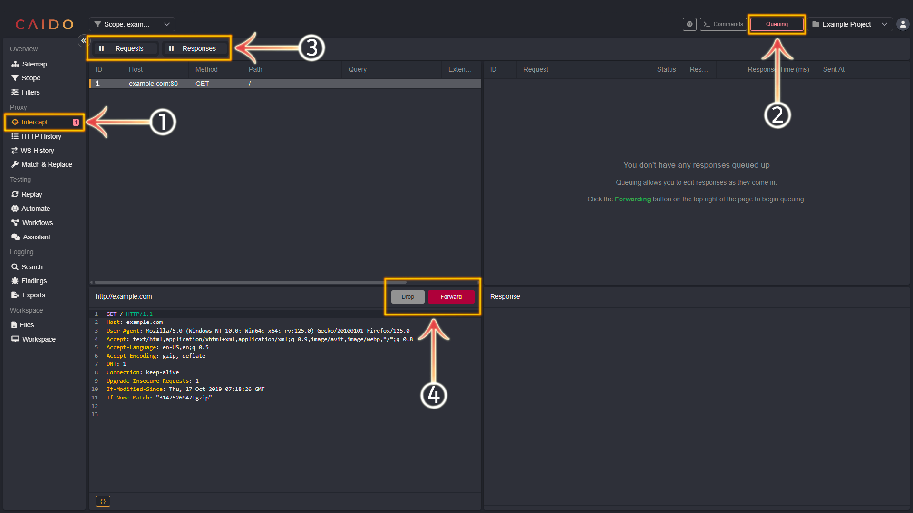
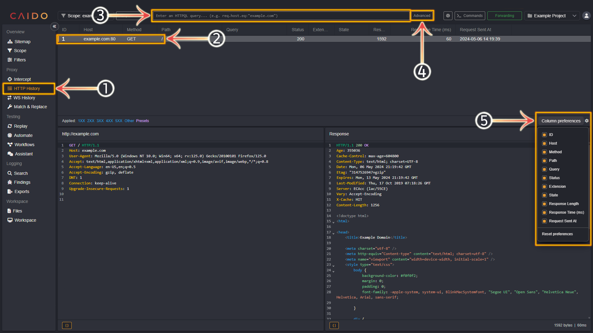
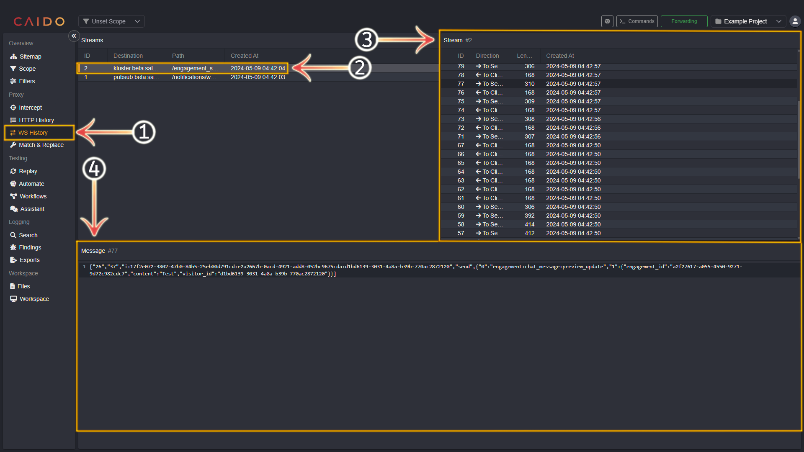

# Capturing and Inspecting Web Traffic

## Intercept

_For advanced documentation on this topic - click [here](../../features/proxy/intercept.md)._

---

`Intercept` allows you to capture requests as well as responses for inspection/modification and forward or drop them arbitrarily. **Requests** are shown on the left and **responses** are shown on the right.

1. Select the `Intercept` tab from the left-hand menu within the Caido window.
2. Clicking this button will toggle between `Queuing` (_intercept traffic_) and `Forwarding` (_forward traffic_).
3. Click `Requests`, `Responses` or **both** to specify what `Queuing` is applied to. _**Intercept on** is signified by `||` and **intercept off** is signified by `>>`._
4. The `Drop` and `Forward` buttons will drop or forward requests/responses respecively.

## HTTP History

_For advanced documentation on this topic - click [here](../../features/proxy/http_history.md)._

---

The `HTTP History` tab lists all the traffic that Caido has proxied.

1. Select the `HTTP History` tab from the left-hand menu within the Caido window.
2. All the proxied requests will appear in this pane. Select them arbitrarily.
3. Search/filter for requests or responses within Caido's history by entering an [HTTPQL query](../../concepts/httpql.md) in this input bar.
4. Clicking the `Advanced` button will present checkbox options to further filter what is displayed in the history (_filter by response status code(s) and custom presets_).
5. Clicking the `Column preferences` cog wheel icon will present checkbox options that you can select/deselect to customize the information provided about each request.

## WS History

_For advanced documentation on this topic - click [here](../../features/proxy/ws_history.md)._

---

The `WS History` tab lists all of the WebSocket stream traffic that Caido has proxied.

1. Select the `WS History` tab from the left-hand menu within the Caido window.
2. All the proxied WebSocket streams will appear in this pane. Select them arbitrarily.
3. Select a message within the selected stream in this pane.
4. The contents of the selected message are presented in this pane.

**Tip:** _You can click on any of the column names above the request/response/stream list pane to sort in ascending/descending/alphabetical/numerical order, by extension/presence/absence/size, or by time waited/time sent depending on the tab/category selected._

## Forwarding and Modifying Requests Repeatedly

---

Once you have familiarized yourself with capturing and inspecting web traffic - basic modification steps using `Replay` are available here:

- [Forwarding and Modifying Requests Repeatedly](./replay.md)
