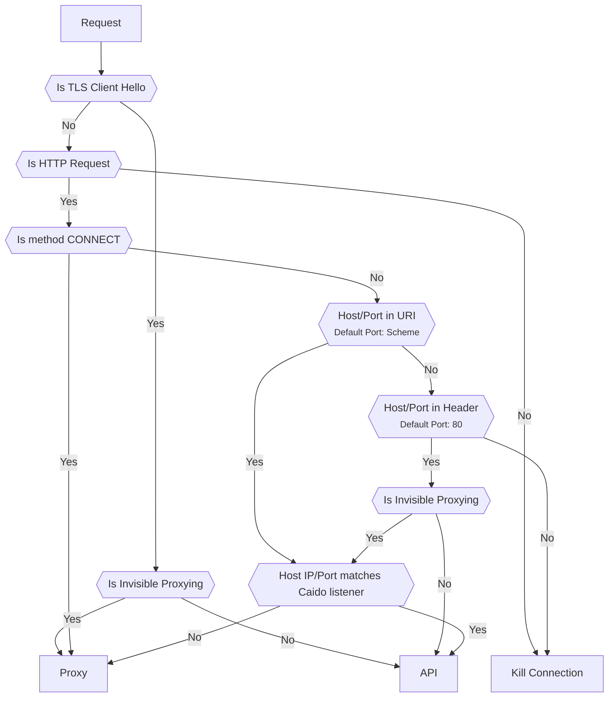
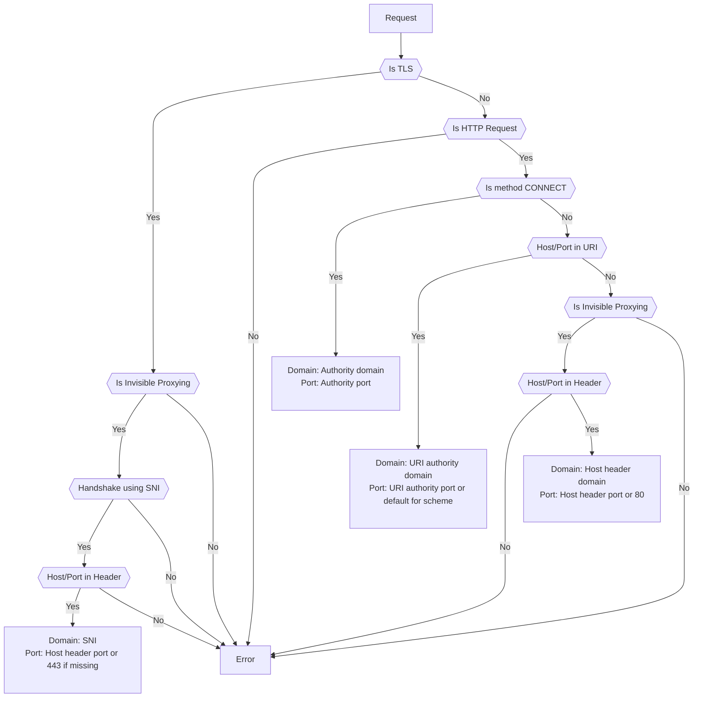

# Traffic Splitting

By default Caido will listen on a single port for all traffic, it uses a splitting algorithm to determine if a request is for the UI/[GraphQL API](/concepts/internals/graphql) or if it's a normal user request that needs to be forwarded. This allows for a simpler user experience, but can sometimes have unexpected behaviour.

::: info
To add other listeners, refer to the [guide on the topic](/guides/listening_address.md).
:::

## Traffic Split Algorithm

We use the following algorithm to route a given request to the right location.
In the diagram, `Proxy` represents forwarded requests, `API` represents the Caido UI/GraphQL API and `Kill Connection` means the client connection will be closed.

:::info
If you the algorithm doesn't work for your particular setup, consider [adding other specific listeners](/guides/listening_ports.md) that will route directly to the proxy or the UI/API.
:::



### `Is method CONNECT`

```http
CONNECT example.com:443 HTTP/1.1
Host: localhost:8080
```

Per the spec, the port should always be present for a connection

### `Host/Port in URI`

```http
GET http://example/resource HTTP/1.1
Host: localhost:8080
```

Here the port used will be inferred as 80 using the scheme (`http`).

### `Host/Port in Header`

```http
GET /resource HTTP/1.1
Host: example.com
```

Here the port used will be inferred as 80 since it is not specified.

### `Host IP/Port matches Caido listener`

This means that if Caido is listening on `127.0.0.1:8080` then the DNS resolution of the target must match both the IP and port.
Things do get a bit tricky when listening on `0.0.0.0:8080` since it will depend on which interface the request comes from.

In some setup like `Docker` where you might do forwarding across interfaces and ports (when doing something like `docker run -p 8084:8080 caido/caido:latest`), this will likely not match since the target will be `127.0.0.1:8084` but the listener will be something like `172.17.0.2:8080`. In this case, you should use [specific listeners](http://localhost:5173/guides/listening_address.html#adding-other-listeners) for proxying and UI.

## Upstream Determination Algorithm

Once Caido has determined that the request should be forwarded (`Proxy`), it uses the following algorithm to determine to what upstream it should send the request to:


