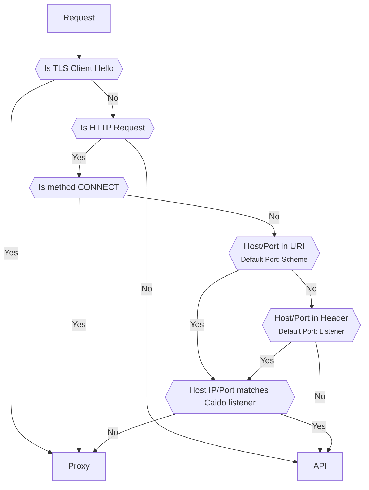
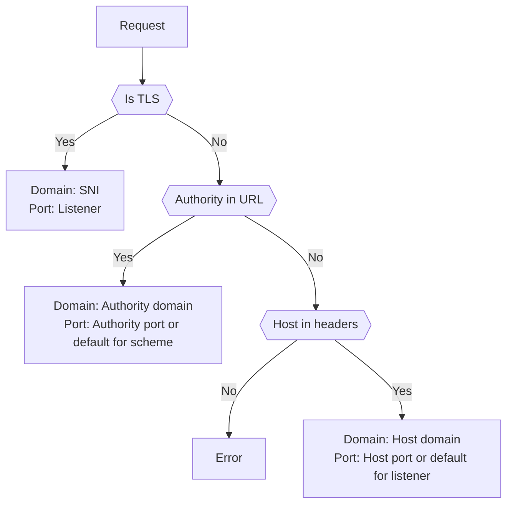

# Traffic splitting

By default Caido will listen on a single port for all traffic, it uses a splitting algorithm to determine if a request is for the UI/[GraphQL API](/concepts/internals/graphql) or if it a normal user request that needs to be forwarded. This allows for a simpler user experience, but can sometimes have unexpected behaviour.

::: info
To add other listeners, refer to the [guide on the topic](/guides/listening_address.md).
:::

## Traffic split algorithm

We use the following algorithm to route a given request to the right location.
In the diagram, `Proxy` is for forwarded requests and `API` is for Caido UI/GraphQL API.

## Upstream determination algorithm

Once Caido has determined that the request should be forwarded (`Proxy`), it uses the following algorithm to determine to what upstream it should send the request to:

