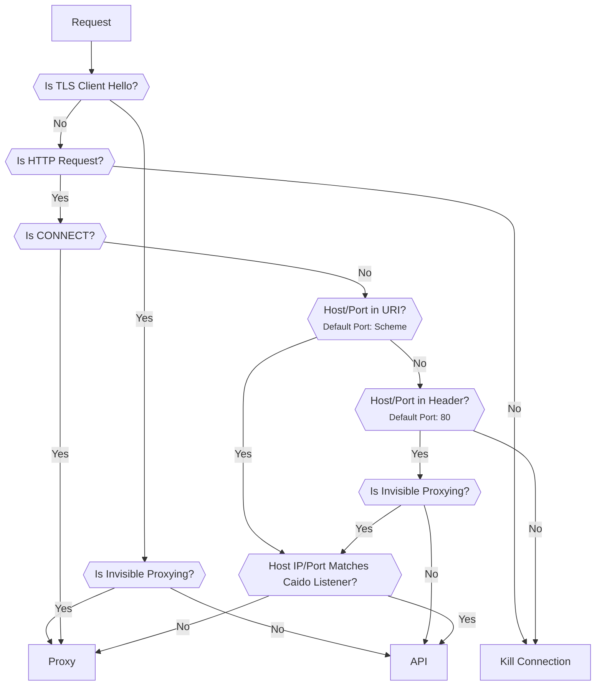
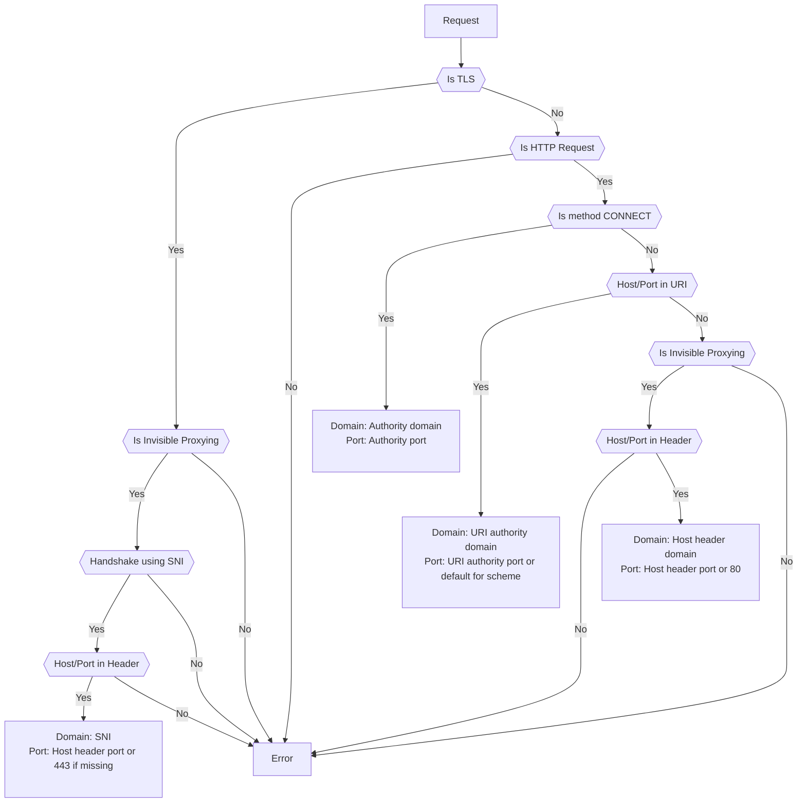

# Traffic Splitting

By default Caido listens for all traffic on a single port and uses a splitting algorithm to determine if a request is intended for either:

- The Caido GUI (_client component_).
- Or the Caido CLI (_server component_).

## Traffic Split Algorithm

The following diagram is a representation of the algorithm that is used to route a request to the correct component.

- `API`: Represents the Caido GUI.
- `Proxy`: Represents the Caido CLI.
- `Kill Connection`: Represents the closure of the client connection.

::: info
If the algorithm doesn't work for your particular setup, consider [adding other specific listeners](/guides/listening_ports.md) that will route directly to the proxy or the GUI/API.
:::

## Upstream Determination Algorithm

Once Caido has determined that the request should be forwarded (`Proxy`), it uses the following algorithm to determine to what upstream it should send the request to:

