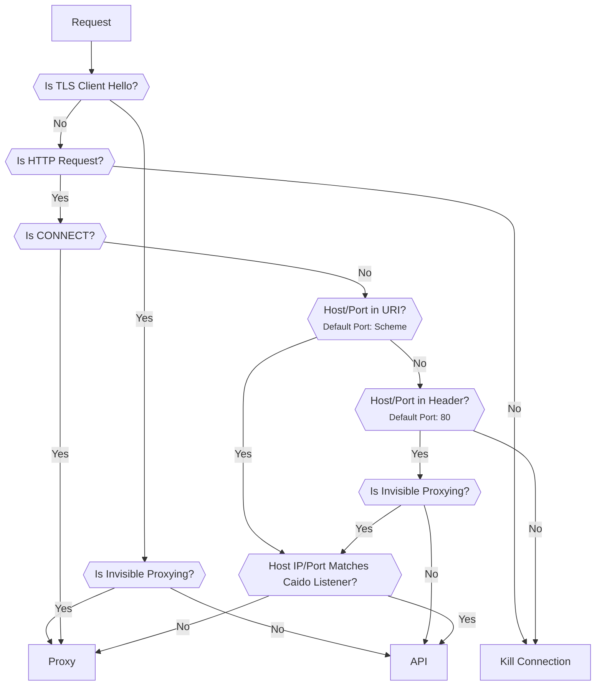
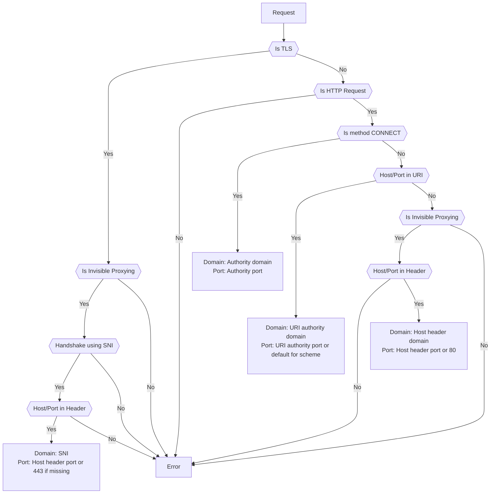

# Traffic Splitting

By default Caido listens for all traffic on a single port and uses a splitting algorithm to determine if a request is intended for either:

- The Caido GUI (_client component_).
- Or the Caido CLI (_server component_).

## Traffic Split Algorithm

The following diagram is a representation of the algorithm that is used to route a request to the correct component.

- `API`: Represents the Caido GUI.
- `Proxy`: Represents the Caido CLI.
- `Kill Connection`: Represents the closure of the client connection.

::: info
If the algorithm doesn't work for your particular setup, consider [adding other specific listeners](/guides/listening_ports.md) that will route directly to the proxy or the GUI/API.
:::



## WIP

When the client sends a HTTP request through Caido, Caido receives:

```http
GET http://example.com/resource HTTP/1.1
Host: example.com
User-Agent: curl/8.16.0
Accept: */*
Proxy-Connection: Keep-Alive
```

HTTP requests intended for the GUI (direct request):

```http
GET / HTTP/1.1
Host: localhost:8080
User-Agent: curl/8.16.0
Accept: */*
```

When the client sends a HTTPS request through Caido, Caido receives:

```http
CONNECT example.com:443 HTTP/1.1
Host: example.com:443
User-Agent: curl/8.16.0
Proxy-Connection: Keep-Alive
```

### Is CONNECT?

If a client is aware of Caido and configured to send its traffic to it instead of sending it directly to the destination server, in order to specify the intended recipient, the client will send an HTTP CONNECT method request to the listening address of Caido.

This initial request specifies the destination server the client would like Caido to establish a connection with and forward requests to.

```http
CONNECT example.com:443 HTTP/1.1
Host: localhost:8080
```

If the request is not a CONNECT request, either the client is unaware of Caido as a proxy server or the request is intended for the Caido GUI.

### Host/Port in URI

If the destination server is specified in the request line, the port number is inferred based on the schema:

- `http://`: `80`
- `https://`: `443`

Cleartext HTTP Proxying

```http
GET http://example.com/resource HTTP/1.1
Host: localhost:8080
```

```http
GET 127.0.0.1:8080 HTTP/1.1
Host: localhost:8080
```

### Host/Port in Header

If the destination server is specified in the `Host` header, the port number defaults to `80`.

```http
GET /resource HTTP/1.1
Host: example.com
```

### Host IP/Port Matches Caido Listener

This means that if Caido is listening on `127.0.0.1:8080` then the DNS resolution of the target must match both the IP and port.
Things do get a bit tricky when listening on `0.0.0.0:8080` since it will depend on which interface the request comes from.

In some setup like `Docker` where you might do forwarding across interfaces and ports (when doing something like `docker run -p 8084:8080 caido/caido:latest`), this will likely not match since the target will be `127.0.0.1:8084` but the listener will be something like `172.17.0.2:8080`. In this case, you should use [specific listeners](http://localhost:5173/guides/listening_address.html#adding-other-listeners) for proxying and UI.

## Upstream Determination Algorithm

Once Caido has determined that the request should be forwarded (`Proxy`), it uses the following algorithm to determine to what upstream it should send the request to:


