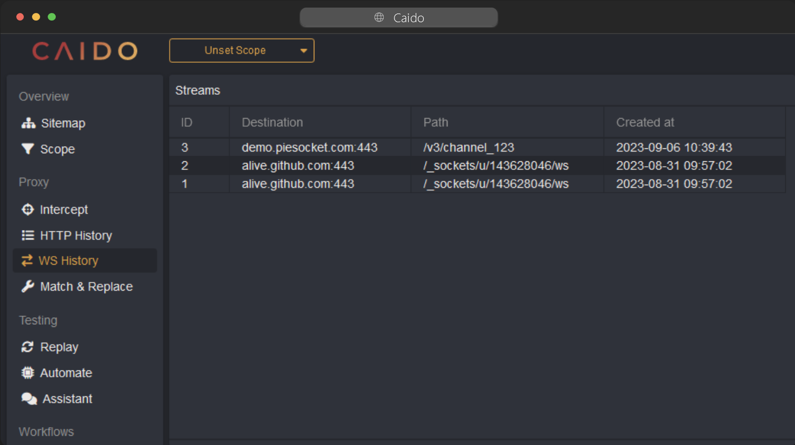
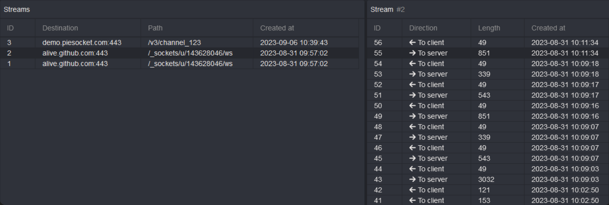
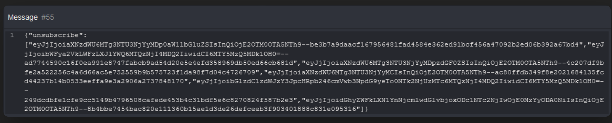

# WS History

## Streams

The WS History feature allows you to view data exchange between the client and the server passing through the proxy.

When an HTTP Connection is upgraded to Websocket, it will appear in the stream table.

  Clicking on a stream will display the messages and their direction.

  You can open each message to display the content.

## Scopes

[Scopes](/features/overview/scope.md) can be used to limit the domains displayed in the stream's table.

