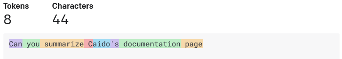
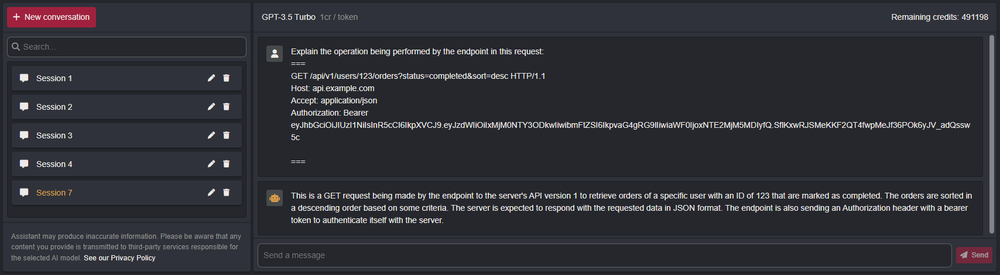
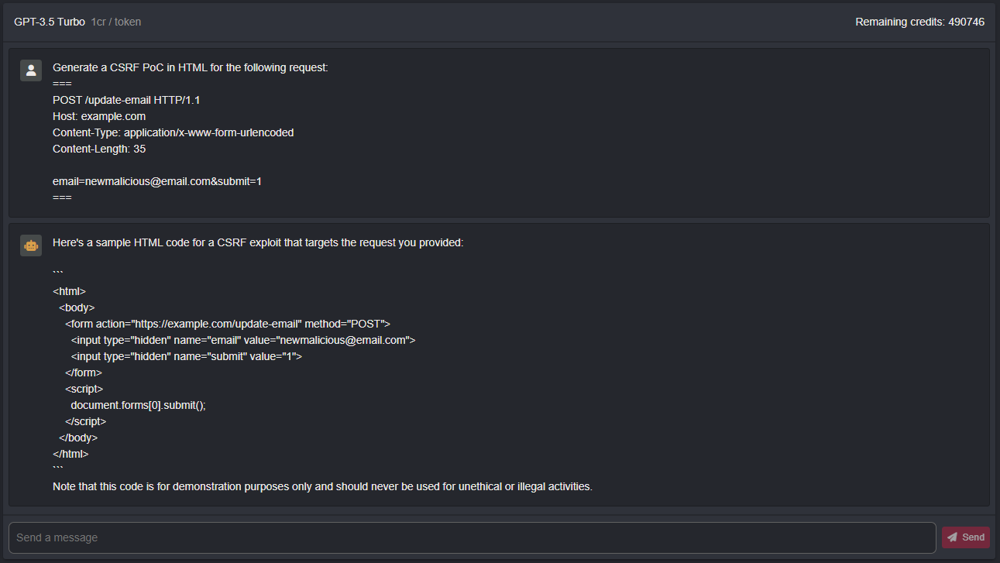

# Assistant

> **PRO FEATURE**

The Assistant page is a feature offered for **Pro users**.
It helps you understand requests, explains elements like headers and suggests attack vectors.

> The AI assistant in Caido is taylored for security research. See [our privacy policy](https://caido.io/privacy) for more info.

>Data is sent to a third party (OpenAI) and can be stored for up to 30 days. See [their privacy policy](https://openai.com/policies/privacy-policy) for more info

Make sure to anonymize sensitive information when you use this tool.

## Credits system

To prevent abuse, we use a credit system. Each pro user gets 500 000 credits per month.

Credit usage depends on the model used (currently only ChatGPT-3.5).

- 1 credit = 1 token is only valid for the gpt-3.5-turbo model, we will add support for the other models eventually.
- A token is roughly a word or ¾ of a word.

- For more info on what a token is : [ChatGPT Tokenizer](https://platform.openai.com/tokenizer)

>Large Language Models (LLM) like GPT-3.5 are created through deep learning techniques and have the capability to understand, generate and manipulate text in a wide range of natural language tasks. However, there are certains limitations to LLMs such as hallucinations (LLMs generating info that is not accurate or even completely fabricated), lack of understanding, bias or quality variations. LLMs are not going to ''hack for you'' since they have no consciousness or intent. They generate responses based solely on patterns in the data and input they receive.

## Explain requests

The Assistant page helps you understand what a request is doing by explaining it in natural language.

Be careful if your payload is huge, it can cost a lot of credits.

## Generate CSRF

The Assistant page currently allows you to generate proof of concept [CSRF's](https://owasp.org/www-community/attacks/csrf).  We are planning to add more attacks in the future.

You can generate CSRF payloads for a specified request.

