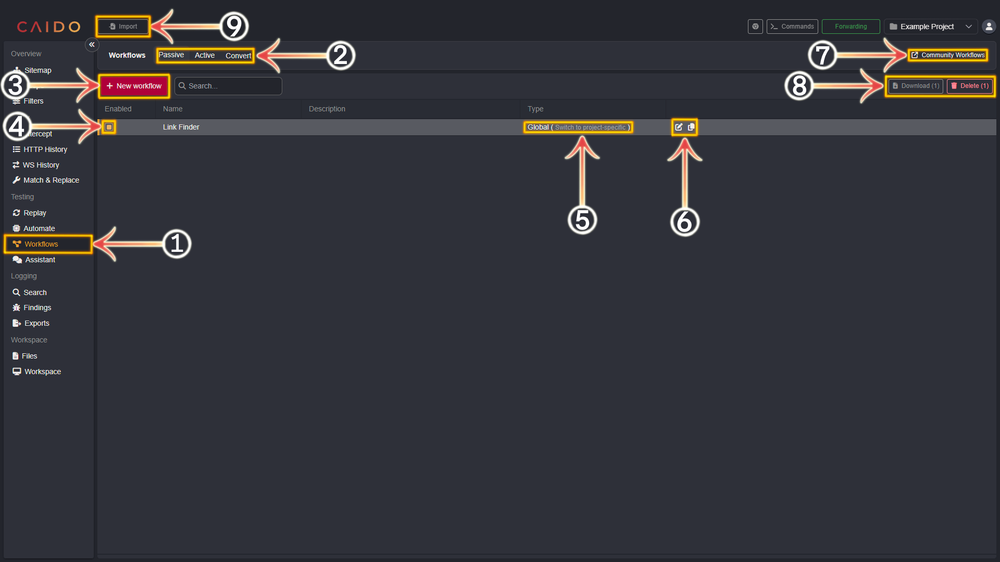

# Enhanced Testing Using Workflows

_For conceptual documentation on the concept of Workflows - click [here](/concepts/workflows.md)._

---

Incorporating **Workflows** into your methodology greatly extends the functionality of Caido. The level of customization offered by Caido Workflows allows you to  repeatedly apply certain actions/conversions that are commonly used in your testing process. Anything from encoding data to complex sequences of modifications based on certain conditions by utilizing flow paths are possible with Workflows.

Multi-step processes that, before, needed to be performed manually can be saved within a Workflow for immediate, discretionary and repeated use - ensuring your testing is as time-efficient as possible.

## Workflow Data Types

---

The data types that Workflows intake include:

- **Bytes**
- **Strings**
- **Boolean Values**
- **Integers**
- **Request Objects**
- **Response Objects**

## The Workflows Tab

---

