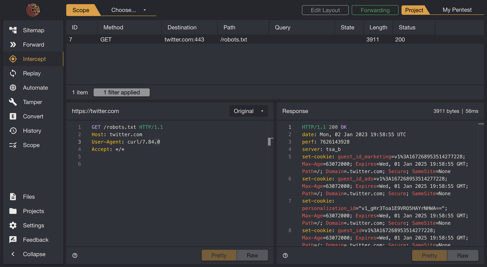

# Introduction

Caido is a cutting-edge web application security tool that enables users to efficiently identify and assess potential vulnerabilities in their web applications.

It can be easily integrated into both personal and enterprise environments, making it adaptable to a wide range of needs and setups.

Easy to use, yet powerful, Caido is suitable for both seasoned security professionals and newcomers. We aim to make a difference in the security testing community by making professional-grade tools accessible to all.

