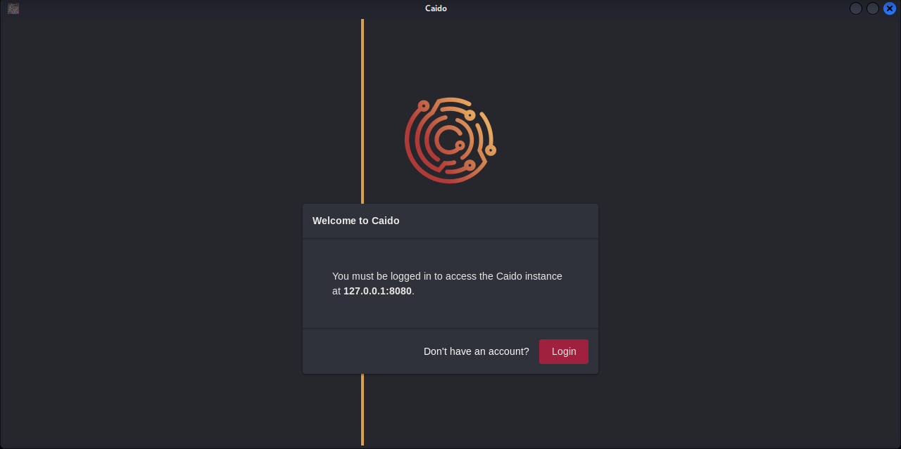
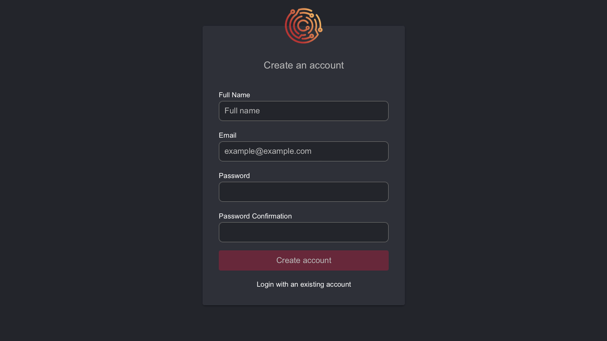

# Linux Desktop AppImage Installation

## Common Errors

When installing and setting up Caido, you may experience common errors that are already annotated with resolutions here:

[Common Errors](../common_errors.md)

_Refer to this page in the event you do experience an error to ensure a quick installation and setup process!_

Still stuck?

[Report a Bug](../report_bug.md)

## Downloading Caido

- **1.** Visit **<https://caido.io/download>** and select - **Download Desktop App (Experimental)** in the **Linux** panel:


- **2.** In a **terminal**, navigate to the same directory that the download is in and run the following command (_ensure the correct version numbers replace the X characters for your download_):

```
sudo chmod +x caido-desktop-vX.XX.X-linux-x86-64.AppImage -v
```

- **3.** **_OPTIONAL_** Rename the download by running the following command (_you may replace **"caido"** with the name of your choice, again - ensure the correct version numbers replace the X characters for your download_):

```
mv caido-desktop-vX.XX.X-linux-x86-64.AppImage caido
```

## Setting Up Caido

- **4.** Launch Caido by double-clicking the application icon or by running the following command (_if you renamed the executable, substitute its name_):

```
./caido
```

- **5.** Click the **Start** button, immediately after you will be met with a prompt stating you must be logged in to use the Caido instance:




- **7.** Both **Login** and **Don't have an account** buttons will open a new browser window. Select the appropriate option for you.




**_If you created a new account - you will receive an email from <info@caido.io> that contains an account verification link. Click on this link to complete account registration!_**


Once your account is activated - click the **Login** button, log in with your credentials and proceed to the next step.

- **8.** Allow access to your Caido account (_"Name" will be replaced with your account identifier_):


## Tutorial

- **9.** Next, you will be guided through a brief tutorial on creating new Projects in Caido.

## CA Certificate

- **10.** In order for Caido to capture your HTTP/S traffic - you must download **Caido's CA Certificate** and import it into your browser. Select **Linux** and either **Firefox** or **Chrome** depending on which browser you use. Then, follow the step-by-step instructions within the application!


### Further Information

**[FAQ](/./faq.md)** - Frequently Asked Questions

**[Doucmentation Directory](/./doc_directory.md)** - Navigate all available documentation.
